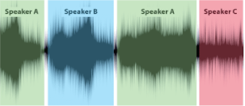
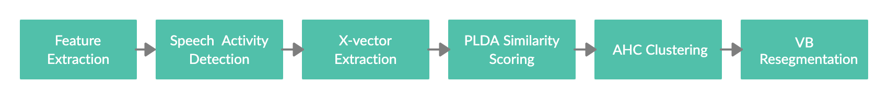
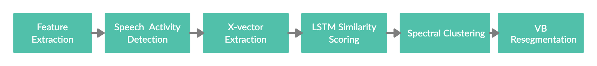
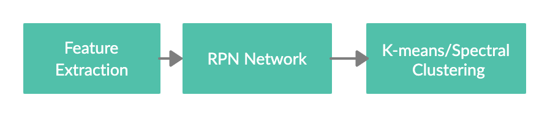

# Speaker Diarization
## Team
An international research group from Nanyang Technical University Singapore, Hunan University China, BITS Pilani India headed by [Dr Eng-Siong Chng](https://scholar.google.com/citations?user=FJodrCcAAAAJ&hl=en), [Dr Xionghu Zhong](https://scholar.google.com/citations?user=V-ISRXwAAAAJ&hl=en) and [Dr Van Tung Pham](https://scholar.google.com/citations?user=8o42XvkAAAAJ&hl=en)

<p >
  
   
   
</p>

##  Problem Statement
Speaker Diarization is a process to answer the question of 'who spoke when?' in an audio file. It annotates timeframes in an audio according to the speaker of the frame.

<p align="center">
  
 </p></center>
 
 A typical Speaker Diarization pipeline involves solving various subproblems, broadly: Identification of speech regions, Extracting features from speech frames, clustering them, and an optional resegmentation step to refine predictions. 
 

 ## Install
1. Clone this project
```bash
git clone https://github.com/sehgal-simran/Speaker-Diarization.git
cd Speaker-Diarization
```

 ## Implemented Approaches
 To find a good baseline, we reviewed many recent works and found 2 common types of systems:
 1. <b><i>Kaldi-based</b></i>: These are systems built on top of the robust kaldi speaker diarization recipe involving x-vectors, by modifying one or more components in the pipeline. 
 
 2. <b><i>End-to-End/ Neural-based</b></i>: These are systems which combine many modules of the pipeline within a single (often neural network based) model. They have potential to be/already are end-to-end i.e input is audio and output is speaker labels.
 
 We implemented and reviewed 3 approaches:
 <br>
  <b>   a) Kaldi's original x-vector [recipe](https://github.com/kaldi-asr/kaldi/blob/master/egs/callhome_diarization/v2/run.sh)</b>
     <p align="center">
     
     </p> 
 
  <b>   b) Kaldi's x-vector with an [LSTM similarity](https://github.com/sehgal-simran/Spk-Dzn/tree/main/LSTM) scoring module </b>
     <p align="center">
     
     </p> 
 
  <b>   c) [Region Proposal Network](https://github.com/sehgal-simran/Spk-Dzn/tree/main/RPNSD) for Speaker Diarization.</b>
        <p align="center">
       
         </p> 
     
## Results

The 3 systems are evaluated on the CALLHOME dataset with a collar of 0.25 secs using the standard md-eval.pl script for scoring. The inference time is simply the proportion of time taken for diarization out of total time of diarized speech. It is meant to give an idea about the speed of the system.

| Pipeline | DER (overlap) | DER (no overlap) | Inference time| Testing Method
|---|---|---|---|---|
| Original Kaldi x-vector | 16.78% | 7.09% | 19%| PLDA is adapted and tested on Callhome using 2-fold cross validation|
| Kaldi x-vector with LSTM | 16.52% | 6.52%| 18%| LSTM model is trained entirely on Callhome and tested using 5-fold cross validation|
| RPNSD | 18.22% | 12.93% | 4%| RPNSD model is adapted and tested on Callhome using 5-fold cross validation|

 ## Literature Reviewed
 | Research Paper | Year|
 |---|---|
 |[Speaker Diarization with Region Proposal Network](https://arxiv.org/abs/2002.06220)|2020|
 |[LSTM based Similarity Measurement with Spectral Clustering for Speaker Diarization](https://arxiv.org/abs/1907.10393)|2019|
 |[Discriminative Neural Clustering for Speaker Diarization](https://arxiv.org/abs/1910.09703)|2019|
 |[Fully Supervised Speaker Diarization](https://arxiv.org/abs/1810.04719)|2019|
 |[End-to-End Neural Speaker Diarization with Self Attention](https://arxiv.org/abs/1909.06247)|2019|
 |[End-to-End Neural Speaker Diarization with Permutation-Free Objectives](https://arxiv.org/abs/1909.05952)|2019|
 |[Speaker Diarization with Deep Speaker Embeddings for DIHARD Challenge II](https://www.isca-speech.org/archive/Interspeech_2019/pdfs/2757.pdf)|2019|
 |[BUT System Description for DIHARD Speech Diarization Challenge 2019](https://arxiv.org/abs/1910.08847)| 2019|
 |[Speaker Diarization with LSTM](https://arxiv.org/abs/1710.10468)|2018|

